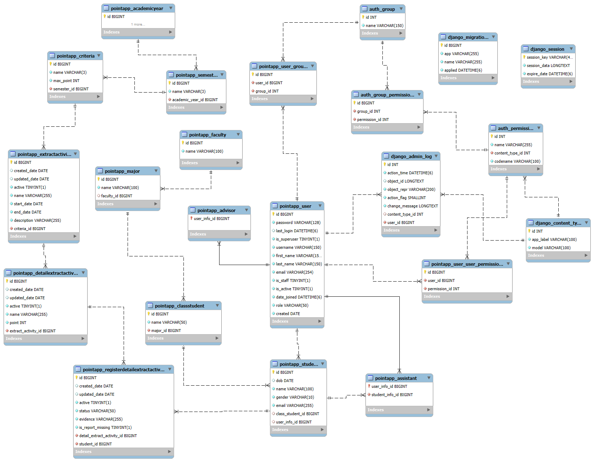

# Student Training Point App

## Introduction  
**Student Training Point App** is a management system developed between December 2024 and February 2025. It is designed to track, evaluate, and update students' training points based on extracurricular activities, evaluation criteria, and academic years. The system supports multiple user roles, ensuring a fair and transparent evaluation process.  


## Table of Contents
- [System Architecture](#system-architecture)
- [Features](#features)
- [Database Schema Diagram](#database-schema-diagram)
- [Demo](#demo)
- [Installation](#️installation)
- [Authors](#authors)

## System Architecture  
- **Backend**: Django REST Framework, MySQL.  
  The backend API is deployed at: [https://pointapp.pythonanywhere.com/](https://pointapp.pythonanywhere.com/).  
- **Frontend**: React Native.  
- **Authentication**: OAuth2 (django-oauth-toolkit) for secure API access.  
- **Task Management**: Scrum methodology using Trello.


## Features  
### 🔹 Role-Based Access  
- **Advisors**: Manage student assistants, track statistics, and export reports.  
- **Assistants**: Approve training points, create activities, and handle student reports.  
- **Students**: Register for activities, track training points, and report missing points.  

### 🔹 Activity Management  
- Students can browse, register, like, and comment on extracurricular activities.  
- Assistants can create activities and upload attendance lists via CSV.  

### 🔹 Training Point Evaluation  
- Students view their training points breakdown.  
- Assistants verify and update points.  

### 🔹 Reports & Exporting  
- Generate and export training point reports (PDF/CSV),with statistical views by faculty, class, and achievements..  

### 🔹 Future Enhancements  
- Real-time chat via Firebase.

## Database Schema Diagram
</img>

## Installation
Follow these steps to install and set up the project:

```bash
git clone https://github.com/NguyenThiMai2k4/student_life_Score.git
cd student_life_Score
# Install the necessary libraries:
npm install
# Start project
npx expo start
```

## Authors

- **[nglhongphuong](https://github.com/nglhongphuong)**  
  *Role*: Built the backend using Django REST Framework, integrated Firebase for real-time features, and developed the frontend for the student module and admin statistics.

- **[NguyenThiMai2k4](https://github.com/NguyenThiMai2k4)**  
  *Role*: Responsible for course activity creation, user account management, and additional features.
